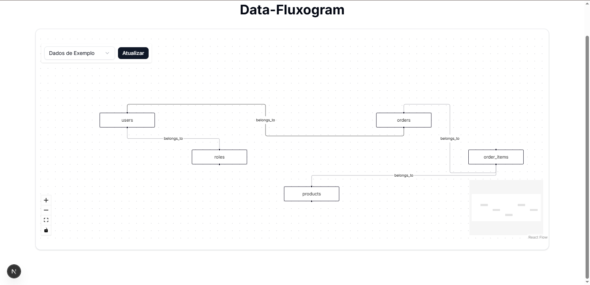

# Data-Fluxogram

Um visualizador de fluxo de dados para bancos de dados em Next.js, utilizando React Flow e componentes do shadcn/ui.



## Visão Geral

Data-Fluxogram é uma aplicação web que permite visualizar dados e relações dentro de qualquer banco de dados. O projeto permite uma visualização clara e interativa das tabelas de banco de dados e seus relacionamentos, facilitando a compreensão da estrutura dos dados.

## Funcionalidades

- Visualização interativa de tabelas de banco de dados e seus relacionamentos
- Interface de usuário moderna com componentes shadcn/ui
- Possibilidade de selecionar diferentes fontes de dados
- Visualização detalhada dos campos de cada tabela
- Diagrama interativo com recursos de zoom, pan e reorganização

## Tecnologias Utilizadas

- [Next.js](https://nextjs.org/) - Framework React com renderização do lado do servidor
- [TypeScript](https://www.typescriptlang.org/) - JavaScript com tipagem estática
- [React Flow](https://reactflow.dev/) - Biblioteca para criação de diagramas interativos
- [shadcn/ui](https://ui.shadcn.com/) - Componentes de UI reutilizáveis
- [Tailwind CSS](https://tailwindcss.com/) - Framework CSS utilitário

## Pré-requisitos

- Node.js 16.x ou superior
- npm ou yarn

## Instalação

Clone o repositório:

```bash
git clone https://github.com/seu-usuario/data-fluxogram.git
cd data-fluxogram
```

Instale as dependências:

```bash
npm install
# ou
yarn install
```

Execute o servidor de desenvolvimento:

```bash
npm run dev
# ou
yarn dev
```

Acesse o aplicativo em [http://localhost:3000](http://localhost:3000).

## Estrutura do Projeto

```
/data-fluxogram
  /src
    /app             # Pasta de páginas do Next.js App Router
      /page.tsx      # Página principal
      /layout.tsx    # Layout da aplicação
    /components
      /ui            # Componentes do shadcn/ui
      /data-flow     # Componentes específicos do fluxograma
        /FlowChart.tsx
        /DataNode.tsx
        /RelationEdge.tsx
        /ControlPanel.tsx
    /data-analise    # Os dados do banco de dados estarão aqui
      /schema.ts
      /sample-data.ts
    /lib
      /utils.ts      # Funções utilitárias
  /public            # Arquivos estáticos
```

## Uso

1. Inicie o servidor de desenvolvimento
2. Acesse a aplicação no navegador
3. Selecione a fonte de dados no painel superior
4. Interaja com o diagrama:
   - Arraste nós para reorganizar
   - Use a roda do mouse para zoom
   - Arraste o fundo para mover o canvas
   - Clique nos nós para ver detalhes

## Personalização

### Adicionando Novas Fontes de Dados

Para adicionar uma nova fonte de dados, crie um arquivo na pasta `/src/data-analise` seguindo o formato do arquivo `sample-data.ts`.

### Estilizando Componentes

O projeto utiliza Tailwind CSS e componentes do shadcn/ui. Você pode personalizar a aparência editando os arquivos de componentes e utilizando classes do Tailwind.

## Contribuindo

Contribuições são bem-vindas! Sinta-se à vontade para abrir um issue ou enviar um pull request.

1. Faça um fork do projeto
2. Crie sua branch de feature (`git checkout -b feature/amazing-feature`)
3. Commit suas mudanças (`git commit -m 'Add some amazing feature'`)
4. Push para a branch (`git push origin feature/amazing-feature`)
5. Abra um Pull Request

## Licença

Este projeto está licenciado sob a licença MIT - veja o arquivo LICENSE para detalhes.

## Próximos Passos

- [ ] Implementar leitura dinâmica de arquivos em `/data-analise`
- [ ] Adicionar filtros e pesquisa
- [ ] Melhorar o layout automático
- [ ] Adicionar recursos para editar as relações
- [ ] Implementar exportação de diagramas
- [ ] Adicionar mais temas e opções de visualização